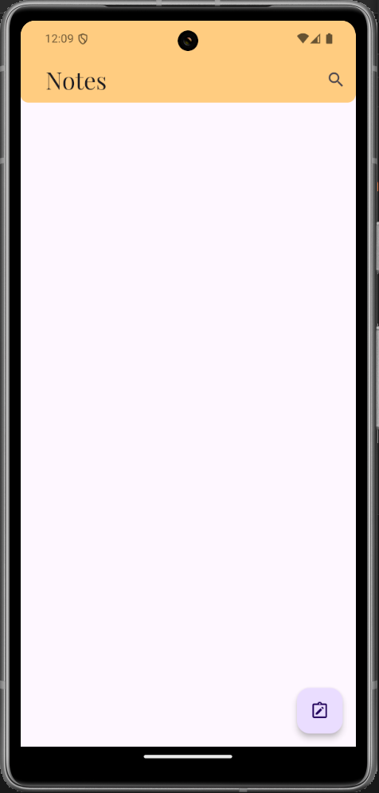
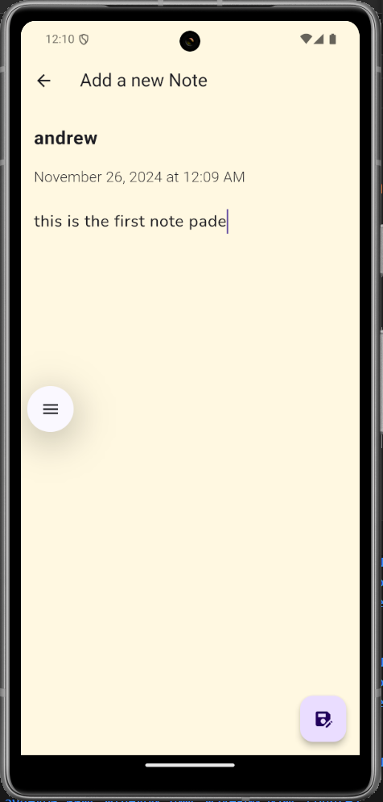
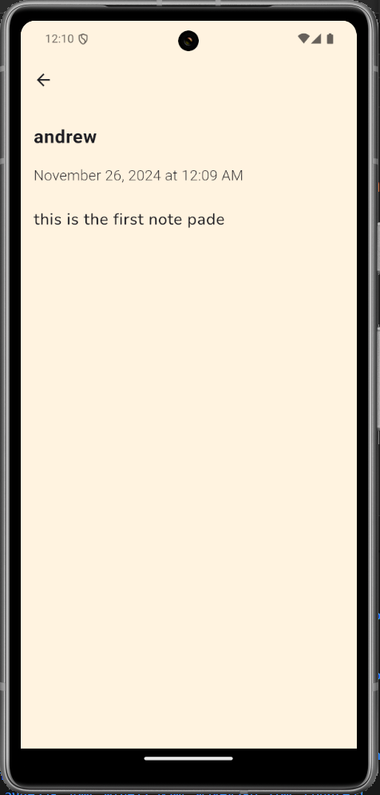
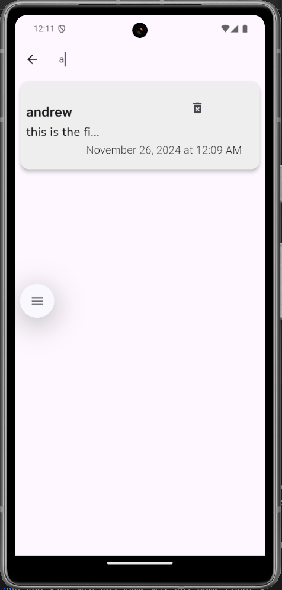
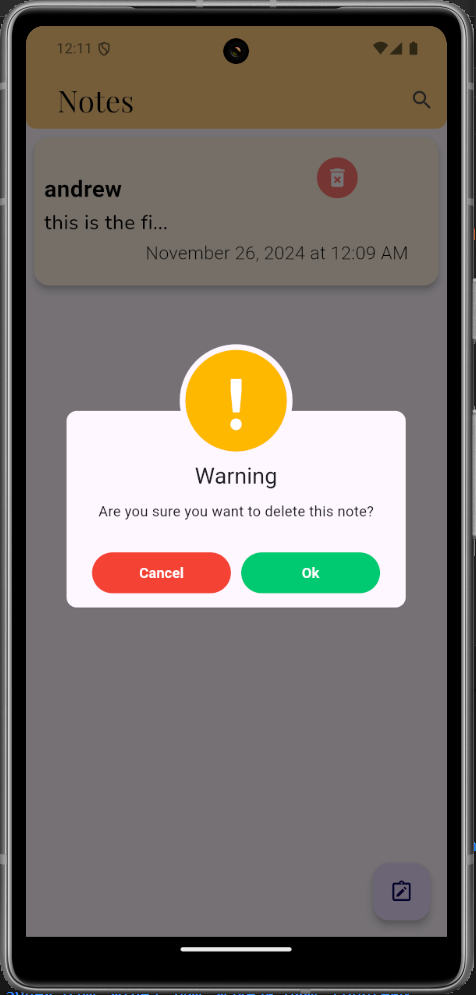

# Notepad App 📝  

A feature-rich notepad application built with Flutter. This app allows users to perform essential note management tasks like viewing, adding, and updating notes.  

## Features ✨  
- **View Notes**: Displays a list of saved notes.  
- **Add Notes**: Add new notes quickly and easily.  
- **Update Notes**: Edit existing notes for updates.  
- **Local Storage**: Data is stored offline using SQLite for better performance and accessibility.  

---

## Folder Structure 🗂️  

```bash
lib/
├── datashowing/       # Displays all the notes
├── getcontroller/     # State management logic
├── insertdata/        # Handles adding new notes
├── searching/         # Search-related functionality
├── sizeconfig/        # Screen size and responsiveness utilities
├── splashview/        # Splash screen implementation
├── sql/               # SQLite database handling
├── style/             # App-wide themes and custom styles
├── update/            # Note updating functionality
├── widget/            # Reusable widgets
├── homepage.dart      # Main app homepage
├── main.dart          # App entry point
```
---
## Tech Stack 🛠️  

- **Frontend**: Flutter (Dart)  
- **Database**: SQLite
- 
---

## Screenshots 📸  

### Homepage  
  

### Add Note Page  
  

### Update Note Page  
  

### Search Notes  
  

### Delete Notes  
  


